# docs/architecture/chat-flow-diagrams.md

# AIChatAssistant 聊天流程图与时序图

## 1. 文档目的

本文档用 Mermaid 图说明 `AIChatAssistant` 第一阶段聊天主链路的整体流程。

本文档用于辅助理解：

- 用户发送消息
- 后端创建 user / assistant message
- SSE 流式返回
- 前端解析 SSE event
- 停止生成
- 失败重试
- ToolCall
- 多会话同时 streaming
- 多页面 / 多 Tab 行为边界
- 历史消息加载与滚动交互
- Harness 如何复用同一套验证场景

本文档只用于辅助理解流程，不作为字段和接口的最高优先级定义。

如果本文档与其他文档冲突，优先级如下：

```text
1. docs/api-contract.md
2. docs/architecture/streaming-protocol.md
3. docs/rules/chat-flow.md
4. docs/architecture/chat-flow-diagrams.md
```

---

## 2. 图示分层原则

主时序图只使用以下参与方：

```text
用户
前端
后端
数据库
```

原因：

- 主流程更清楚。
- Codex 更容易理解边界。
- 避免在主图里混入过多实现细节。

内部实现职责，例如：

- `useChatStream`
- `conversationStore`
- `chatRuntimeStore`
- `chatService`
- `repository`
- `ToolRegistry`

不放进主时序图，而是在“Store 分工图”和“实现提醒”中说明。

---

## 3. 聊天主流程图

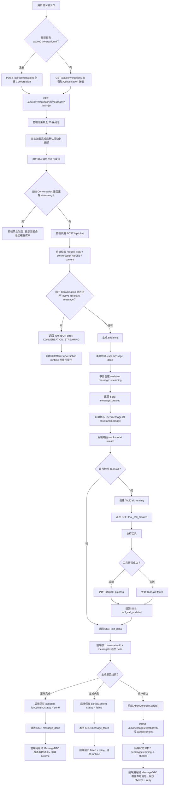

---

## 4. 发送消息主时序图

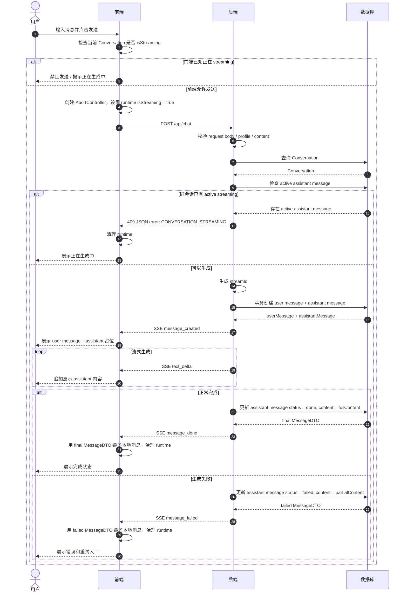

---

## 5. SSE 事件处理时序图

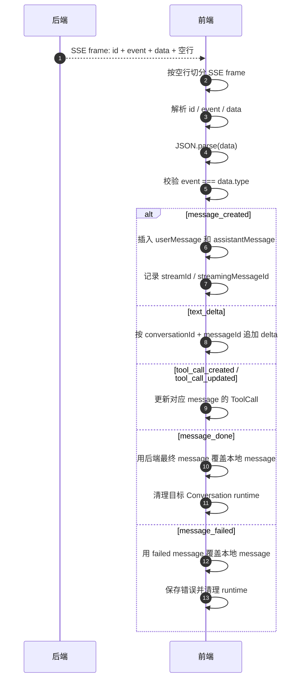

---

## 6. 停止生成时序图

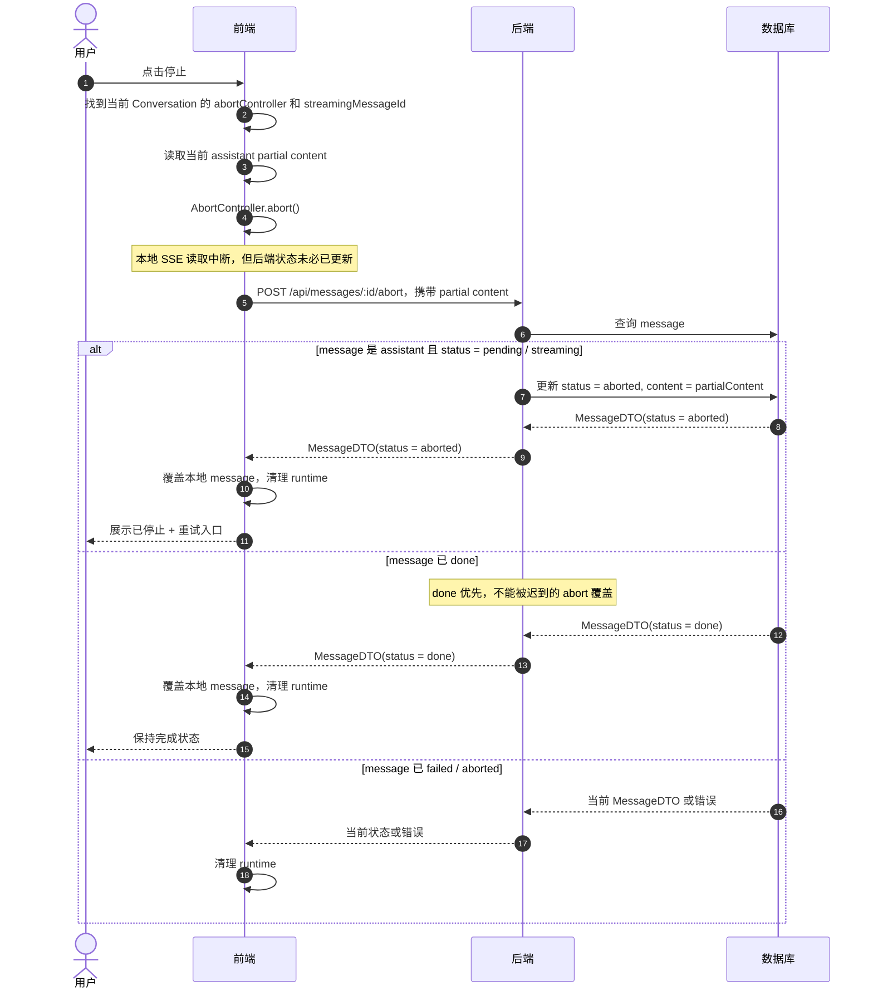

---

## 7. 重试时序图

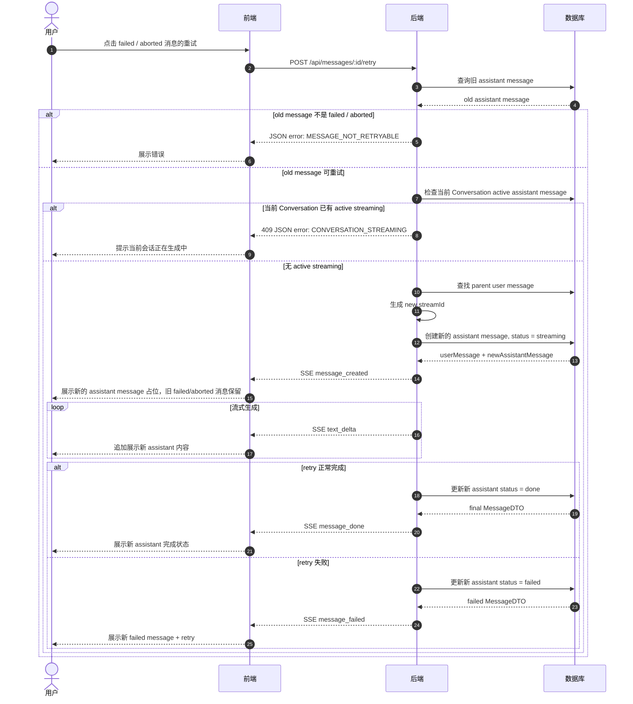

---

## 8. ToolCall 时序图

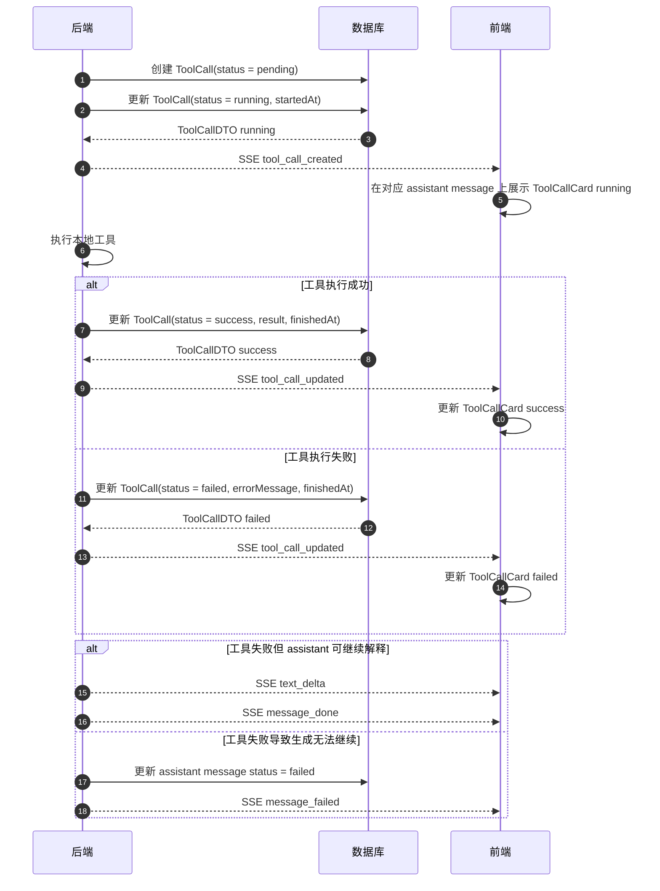

---

## 9. 历史消息加载时序图

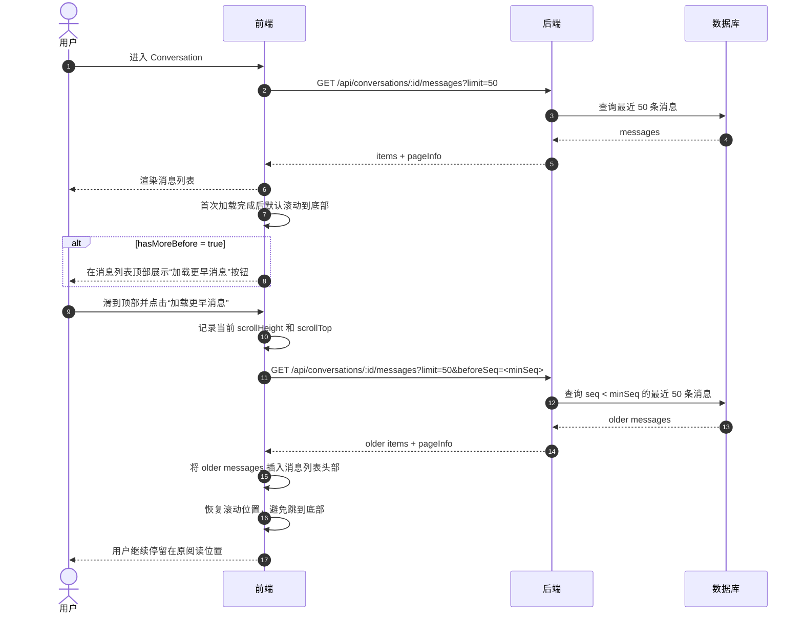

---

## 10. 历史消息加载交互规则

### 10.1 首次进入 Conversation

前端调用：

```text
GET /api/conversations/:id/messages?limit=50
```

后端返回：

- 最近 50 条消息
- 按 `seq ASC` 输出
- `pageInfo.hasMoreBefore`
- `pageInfo.hasMoreAfter`

前端行为：

1. 渲染消息列表。
2. 默认滚动到底部。
3. 如果 `items.length < 50` 或 `hasMoreBefore = false`，不展示“加载更早消息”按钮。
4. 如果 `hasMoreBefore = true`，在消息列表顶部展示“加载更早消息”按钮。

---

### 10.2 加载更早消息

第一阶段不做自动触底加载，采用显式按钮。

触发条件：

```text
用户滑到消息列表顶部
```

前端行为：

1. 顶部展示“加载更早消息”按钮。
2. 用户点击按钮。
3. 取当前消息列表最小 `seq` 作为 `beforeSeq`。
4. 调用：

```text
GET /api/conversations/:id/messages?limit=50&beforeSeq=<minSeq>
```

5. 将返回的 older messages 插入列表头部。
6. 保持当前阅读位置，不要跳到底部。
7. 如果 `hasMoreBefore = false`，隐藏“加载更早消息”按钮。

---

### 10.3 streaming 时自动滚动

streaming 过程中：

- 如果用户接近底部，则 `text_delta` 到来时自动滚动到底部。
- 如果用户已经向上查看历史，不强制滚动到底部。
- 第一阶段可以先不做复杂“新消息提示按钮”，但不要在用户阅读历史时强制拉到底部。

---

## 11. 多会话并发规则图

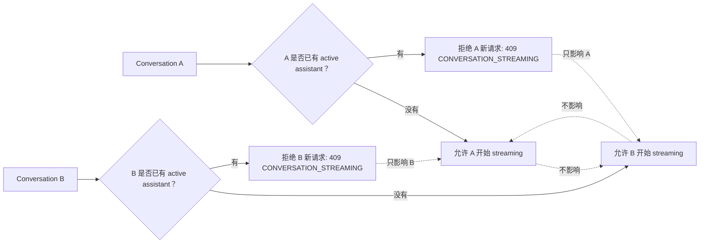

---

## 12. 多页面 / 多 Tab 行为图

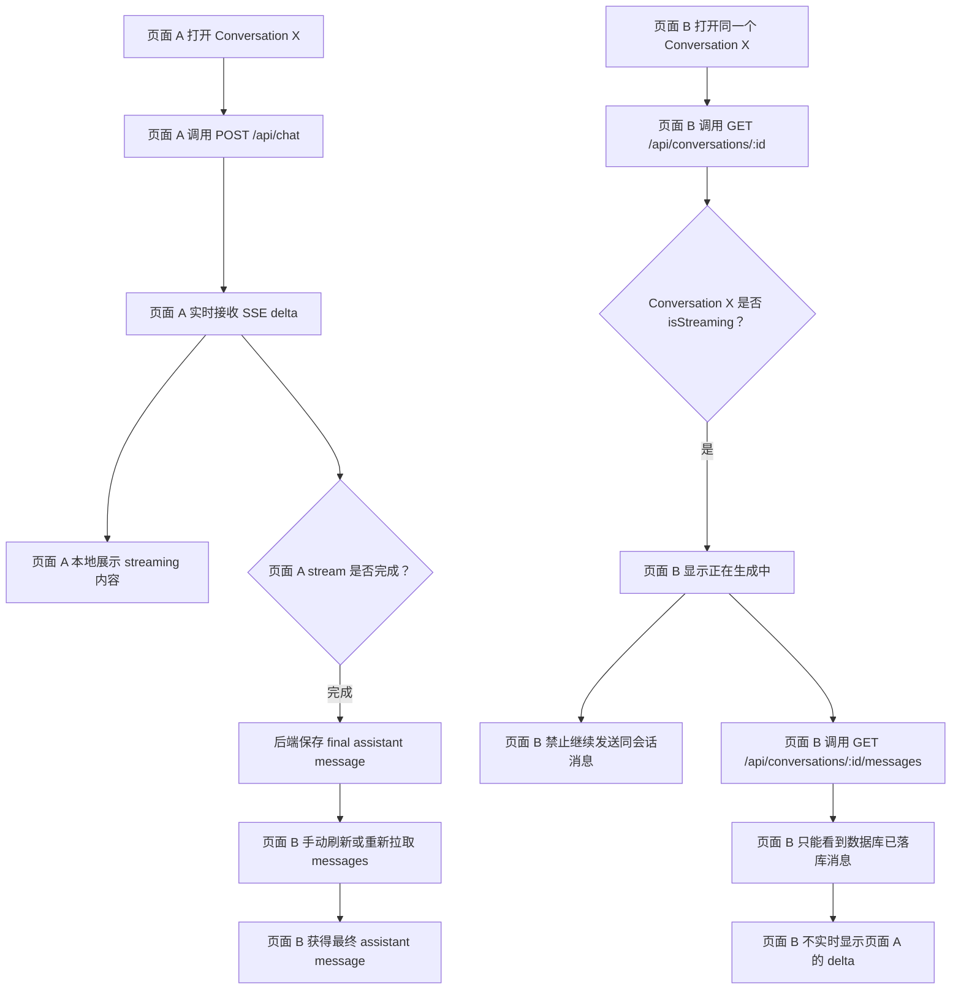

---

## 13. 前端 Store 分工图

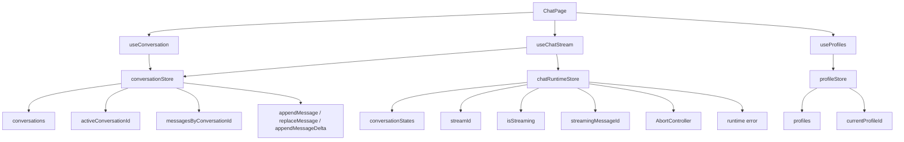

---

## 14. Harness 验证复用图

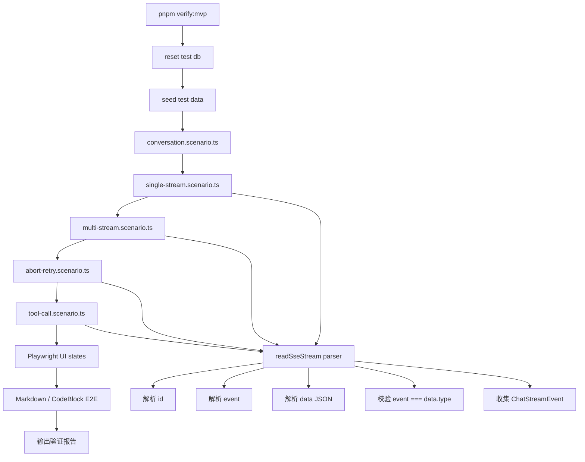

---

## 15. 实现提醒

Codex 实现聊天相关任务时，应先阅读：

```text
docs/api-contract.md
docs/architecture/streaming-protocol.md
docs/rules/chat-flow.md
docs/architecture/chat-flow-diagrams.md
```

实现时以文字契约为准，图只用于理解。

关键边界：

- `POST /api/chat` 和 `POST /api/messages/:id/retry` 返回标准 SSE。
- SSE event 使用 `id + event + data + 空行`。
- `GET /api/conversations/:id/messages` 默认 `limit = 50`。
- 首次加载历史消息后默认滚动到底部。
- 用户滑到顶部后，通过按钮加载更早 50 条。
- 加载更早消息后保持当前阅读位置，不要跳到底部。
- streaming 时，如果用户接近底部，则自动滚动到底部；如果用户正在查看历史，不要强制滚动。
- 不同 Conversation 可以同时 streaming。
- 同一 Conversation 不能同时存在多个 active assistant message。
- 发起生成的页面实时接 SSE delta。
- 其他页面只知道 conversation 正在 streaming，不实时同步 delta。
- 生成完成后，其他页面通过重新拉取 messages 获得最终内容。
- conversationStore 管稳定数据。
- chatRuntimeStore 管运行时 streaming 状态。
- Harness 必须复用真实 SSE parser。
